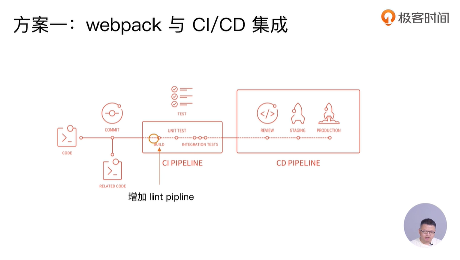

## ESLint的必要性
## 优秀的ESLint规范实践

Airbnb: eslint-config-airbnb、eslint-config-airbnb-base

## 制定团队的ESLint规范
1. 不重复造轮子，基于eslint:recommend配置并改进
2. 能够帮助发现代码错误的规则，全部开启
3. 帮助保持团队的代码风格统一，而不是限制开发体验

|规则名称|错误级别|说明|
|-|-|-|
|for-direction|error|for循环的方向要求必须正确|

|no-await-in-loop|off|允许在循环里使用await|

|no-console|off|允许在代码里使用console|

|no-prototype-builtins|warn|值接调用对象原型链上的方法|

|valid-jsdoc|off|函数注释一定要遵守jsdoc规则|

|no-template-curly-in-string|warn|在字符串里面出现{和}进行警告|

|accessor-pairs|warn|getter和setter没有成对出现时给出警告|

|array-callback-return|error|对于数据相关操作函数比如reduce，map，filter等，callback必须有return|

|block-scoped-var|error|把var关键字看成块级作用域，防止变量提升导致的bug|

|class-methods-use-this|error|要求在Class里面合理使用this，如果某个方法没有使用this，则应该声明为静态方法|

|complexity|off|关闭代码复杂度限制|

|default|warn|switch case语句里面一定需要default分支|

## ESLint如何执行落地
1. 和 CI/CD系统集成
2. 和webpack集成

### 方案一


本地开发阶段增加precommit钩子
安装husky
npm i husky -D

增加npm script，通过lint-staged增量检查修改的文件

```
    "script": {
        "precommit": "lint-staged"
    },
    "lint-staged": {
        "linters": {
            "*.{js,scss}": ["eslint --fix", "git add"]
        }
    }
```
### 方案二
使用eslint-loader，构建时检查JS规范
安装: eslint eslint-plugin-import eslint-plugin-react eslint-plugin-jsx-a11y eslint-loader eslint-config-airbnb
配置.eslintrc.js文件(parser使用babel-eslint)
module.exports ={
    module: {
        rules: [
            {
                test: /\.js$/,
                exclude: /node_modules/,
                use: [
                    "babel-loader",
                    "eslint-loader"
                ]
            }
        ]
    }
}


